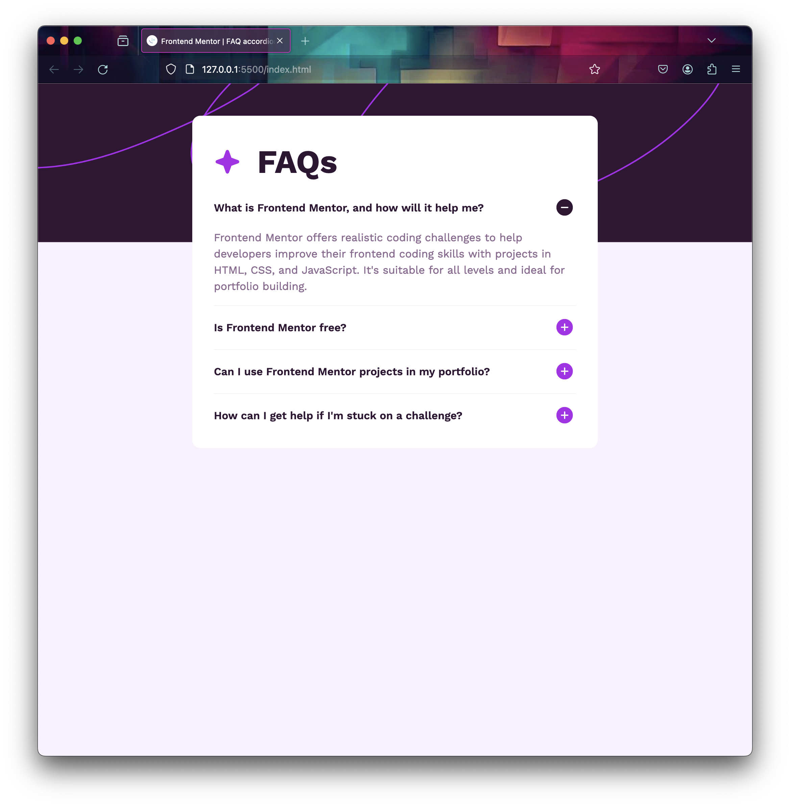

# Frontend Mentor - FAQ accordion solution

This is a solution to the [FAQ accordion challenge on Frontend Mentor](https://www.frontendmentor.io/challenges/faq-accordion-wyfFdeBwBz). Frontend Mentor challenges help you improve your coding skills by building realistic projects.

## Table of contents

- [Overview](#overview)
  - [Screenshot](#screenshot)
  - [Links](#links)
- [My process](#my-process)
  - [Built with](#built-with)
  - [What I learned](#what-i-learned)
  - [Continued development](#continued-development)

## Overview

Fourth challenge done after a two month break. I'm feeling very good about my developing CSS skills. I ran into only one issue with this one that I didn't figure out. I wanted the accordion
to take up the max-width of 600px, but it seems unless the content
needs the space I could only get to 535px. Was unsure of how to
set the width to take up all the space, while remaining responsive.

### Screenshot

### Links

- Solution URL: [https://github.com/TGPJonathon/frontend-mentor-ping](https://github.com/TGPJonathon/frontend-mentor-accordion)
- Live Site URL: [https://tgpjonathon.github.io/frontend-mentor-ping/](https://tgpjonathon.github.io/frontend-mentor-accordion/)

## My process

### Built with

- Semantic HTML5 markup
- CSS custom properties
- Grid & Flex

### What I learned

I learned how to work with accordions in a modern context.

### Continued development

I want to continue learning more about Flexbox & Grid & making accessible layouts.
